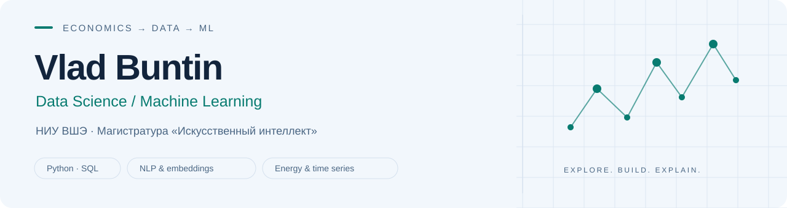

<picture>
  <source media="(prefers-color-scheme: dark)" srcset="assets/banner-dark.svg">
  <source media="(prefers-color-scheme: light)" srcset="assets/banner-light.svg">
  
</picture>

[Проекты](#проекты) · [Инструменты](#инструменты) · [Образование](#образование) · [Контакты](#контакты)

## Обо мне

Я Влад Бунтин, магистрант программы «Искусственный интеллект» на ФКН НИУ ВШЭ. По первому образованию — экономист. Развиваюсь в Data Science и машинном обучении: анализирую финансовые и сметные данные, участвую в проекте по прогнозированию цен электроэнергии и создаю инструменты автоматизации на Python.

Мне интересно связывать математические методы с практическими задачами бизнеса. Ранее работал с данными по закупкам, продажам и остаткам в производственно-торговом бизнесе, а в выпускной работе анализировал сметную документацию нефтегазового объекта.

**Ищу стажировку или начальную позицию в Data Science / ML.** Москва; рассматриваю офис, гибрид и удалённую работу.

## Проекты

### 01 · Прогнозирование цен электроэнергии Day-Ahead

**Командный ML-проект · Энергетика · Временные ряды**

Участвую в команде из **4 человек** в проекте по прогнозированию цен на рынке электроэнергии с использованием методов машинного обучения. **Проект в работе.**

[О проекте →](https://github.com/ver5us1/team134-project)

### 02 · MONEY Market Alert

**Python · PostgreSQL · Finnhub · Ollama · Telegram Bot API**

Новостной Telegram-бот с локальным AI-анализом. Пользователь выбирает компании, а приложение собирает новости, проверяет их релевантность и формирует краткие уведомления о значимых событиях. **Прототип MVP, в разработке.**

[Описание и код →](https://github.com/ver5us1/money-market-alert) · [Архитектура →](https://github.com/ver5us1/money-market-alert/blob/main/docs/architecture.md)

### 03 · Проверка проектно-сметной документации

**Python · Pandas · Matplotlib · Excel → Python**

Анализ сметной документации капитального ремонта нефтегазового объекта стоимостью **более 2,05 млрд ₽**. Перенёс расчёты из Excel в Python, сгруппировал **184 замечания** и оценил их влияние на стоимость. В проекте есть графики, аналитический отчёт, Notebook и тесты.

[Описание и результаты →](https://github.com/ver5us1/smeta-audit-1u151) · [Ноутбук →](https://github.com/ver5us1/smeta-audit-1u151/blob/main/notebooks/01_smeta_audit.ipynb)

### 04 · Profi Order Monitor

**Python · Playwright · JSON · Telegram Bot API**

Локальный мониторинг ленты заказов Profi.ru: сохраняет JSON-снимки, находит ранее неизвестные ID и отправляет уведомления в Telegram. В репозитории есть демонстрационные данные, описание архитектуры и тесты. **Проект в разработке.**

[Описание и код →](https://github.com/ver5us1/profi-order-monitor) · [Архитектура →](https://github.com/ver5us1/profi-order-monitor/blob/main/docs/architecture.md)

### 05 · Выбор источников долгосрочного финансирования

**Python · Pandas · CAPM · WACC · Финансовая аналитика**

Воспроизводимый анализ структуры капитала ПАО «ЛУКОЙЛ» за **2022–2024 годы**. Перенёс расчёты из Excel в Python: финансовые показатели, стоимость собственного и заёмного капитала, WACC и сценарии финансирования. В проекте есть графики, Notebook, тесты и сверка исходных формул.

[Описание и результаты →](https://github.com/ver5us1/long-term-financing-and-capital-structure) · [Ноутбук →](https://github.com/ver5us1/long-term-financing-and-capital-structure/blob/main/notebooks/01_financing_analysis.ipynb)

## Инструменты

| Область | Практика |
| :--- | :--- |
| Python и исследование данных | NumPy, Pandas в учебных задачах, Jupyter Notebook, Matplotlib, Seaborn |
| NLP | Анализ текстовых новостей с помощью готовой LLM через Ollama |
| SQL | PostgreSQL, JOIN, подзапросы, CTE, агрегатные и оконные функции |
| Разработка | Git, GitHub, ветки, Pull Request, слияния и разрешение конфликтов |
| Бизнес-анализ | Excel, сводные таблицы, BPMN, UML, экономические расчёты |

## Образование

**НИУ Высшая школа экономики · ФКН**  
Магистратура «Искусственный интеллект», **2026–2028**, обучение продолжается. Поступил по раннему приглашению с результатом **100/100**.

**РГУ нефти и газа имени И. М. Губкина**  
Бакалавриат, направление «Экономика», **2026**.

## Контакты

[Telegram: @gur99](https://t.me/gur99) · [Почта: v.buntin11@yandex.ru](mailto:v.buntin11@yandex.ru) · [GitHub: ver5us1](https://github.com/ver5us1)
